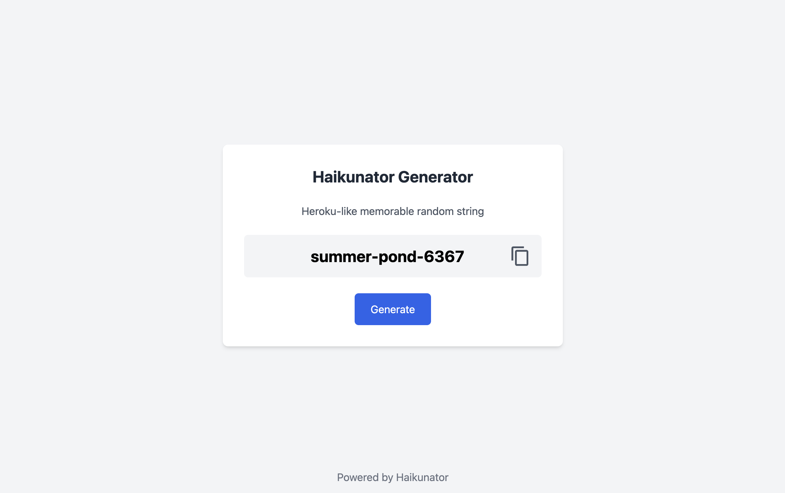

# Haikunator Generator via Loco(Rust)

This is a web service that generates Heroku-like memorable random strings.



# Usage

Web:

[https://haikunator-generator.shuttleapp.rs/](https://haikunator-generator.shuttleapp.rs/)

API:

```console
// JSON
$ curl https://haikunator-generator.shuttleapp.rs/api/gen
{"name":"falling-disk-1736"}

// Plain text
$ curl https://haikunator-generator.shuttleapp.rs/api/gen.txt
broken-wildflower-1928
```

# Development

## In DevContainer

```console
$ rustc --version
rustc 1.80.1 (3f5fd8dd4 2024-08-06)
$ cargo --version
cargo 1.80.1 (376290515 2024-07-16)
$ loco --version
loco-cli 0.2.8
$ cargo shuttle --version
cargo-shuttle 0.47.0
$ npm --version
10.8.2
$ pnpm --version
9.10.0
```

### Start frontend

Run the following commands:

```console
$ cd frontend
$ pnpm dev
```

### Start backend

On another terminal window, run:

```console
$ cargo loco start
```

Then open http://localhost:5150/ in your browser.

## Linting

To format and auto-fix your code, you can use the following command:

```console
$ cargo fmt --all
```

# Deployment

Deploy to [Shuttle](https://console.shuttle.rs/):

```console
$ pushd frontend
$ echo !dist/ >> .gitignore
$ pnpm build
$ popd
$ cargo shuttle login
$ cargo shuttle deploy
$ git checkout frontend/.gitignore
```

# Dependencies

| | |
| -- | -- |
| Rust | [https://www.rust-lang.org/](https://www.rust-lang.org/) |
| Loco | [https://loco.rs/](https://loco.rs/) |
| Shuttle | [https://www.shuttle.rs/](https://www.shuttle.rs/) |
| rust-haikunator | [https://github.com/nishanths/rust-haikunator](https://github.com/nishanths/rust-haikunator) |

