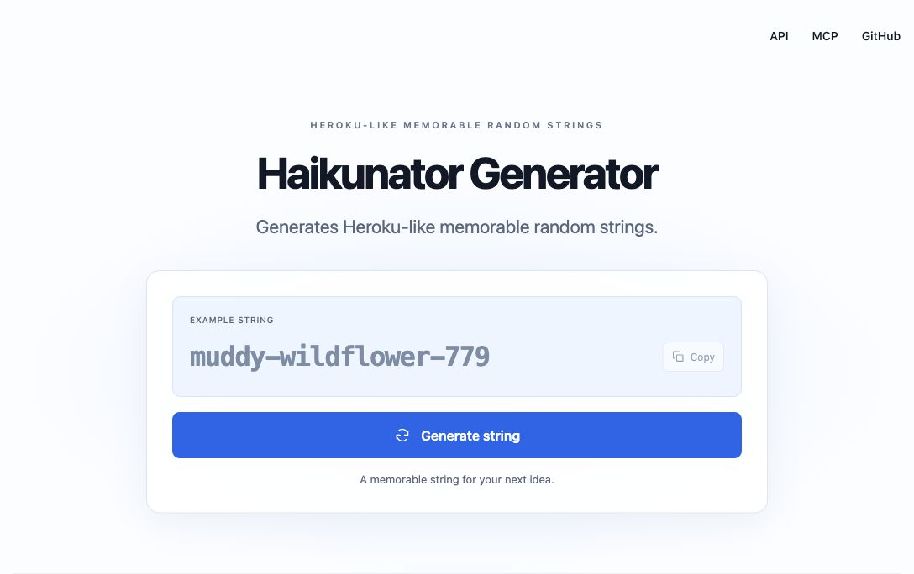

# Haikunator Generator

A web service that generates Heroku-like memorable random strings. The Rust
application uses Axum and Tokio, builds for `wasm32-unknown-emscripten`, and runs
on Cloudflare Workers. Workers Static Assets serves the React frontend.



## Usage

Public service: [https://haikunator-generator.goosysapp.net/](https://haikunator-generator.goosysapp.net/)

```sh
# JSON
curl https://haikunator-generator.goosysapp.net/api/gen
# {"name":"falling-disk-1736"}

# Plain text
curl https://haikunator-generator.goosysapp.net/api/gen.txt
# broken-wildflower-1928
```

The local development commands below do not deploy the application or change
the public service.

### MCP

The same Worker exposes a stateless Streamable HTTP MCP server at `/mcp`, using
the official Rust SDK `rmcp` on Axum and Tokio. The React page and existing
`/api/gen` and `/api/gen.txt` endpoints remain available.

Connect an MCP client to `http://localhost:8787/mcp` during local development.
After deploying this change, the endpoint is
`https://haikunator-generator.goosysapp.net/mcp`.

The `gen` tool is titled "Haikunator Generator", matching this project and the
existing `/api/gen` interface. It takes no arguments and returns one Heroku-like
memorable random string as structured content: `{"name":"falling-disk-1736"}`,
with equivalent JSON text content. Generated strings are not guaranteed to be
unique.

The `gen_continuous` tool, titled "Haikunator Generator Continuous Generation",
generates strings one at a time using Tokio timers and a producer task. Its
arguments are `count` (1–20, default 5) and `interval_ms` (100–2000 milliseconds,
default 500). Each string has the same `{"name":"..."}` shape as `/api/gen`.
The final structured result is `{"results":[{"name":"falling-disk-1736"},...]}`,
with equivalent JSON text content. It waits one interval before each result,
so a call lasts at most 40 seconds.

When a client supplies `_meta.progressToken`, the POST response is a finite SSE
stream. It sends `notifications/progress` from 0 through `count`, with each
generated string encoded as JSON in the progress message, followed by the final
tool result. Without a progress token, the tool returns only the final JSON
response. Closing or aborting that SSE request stops generation; independent
`notifications/cancelled` POSTs are not routed to active requests in this
stateless SDK configuration. The existing
`gen` tool, initialization, and discovery continue to use JSON responses. No
session IDs or persistent GET SSE connections are created.
In local Wrangler, aborting a JSON-only call before its response arrives does
not stop server-side generation; it still finishes within the 40-second limit.
Cancellation of that JSON-only path has not been verified in production.
Use a progress token when you need streaming results and interruption.

The page includes a continuous-generation example below the MCP instructions that calls this MCP tool,
displays each result as it arrives, and lets you stop an active request. Normal
generation and the existing APIs remain available while it is running.

The server supports initialization and tool calls from Streamable HTTP clients.
Like the existing API, it generates random strings without authentication.
MCP requests with a browser Origin must come from the configured public URLs or local ports
8787/5153; requests without Origin are accepted for native MCP clients.

To try the tool with the official MCP Inspector while `pnpm dev` is running:

```sh
pnpm dlx @modelcontextprotocol/inspector@2.8.0 --cli \
  http://localhost:8787/mcp --transport http --method tools/call \
  --tool-name gen
```

For a continuous call without progress notifications:

```sh
pnpm dlx @modelcontextprotocol/inspector@2.8.0 --cli \
  http://localhost:8787/mcp --transport http --method tools/call \
  --tool-name gen_continuous --tool-arg count=5 --tool-arg interval_ms=500
```

To observe the incremental notifications directly:

```sh
curl --no-buffer http://localhost:8787/mcp \
  -H 'Content-Type: application/json' \
  -H 'Accept: application/json, text/event-stream' \
  -H 'MCP-Protocol-Version: 2025-11-25' \
  --data '{"jsonrpc":"2.0","id":1,"method":"tools/call","params":{"name":"gen_continuous","arguments":{"count":5,"interval_ms":500},"_meta":{"progressToken":"demo"}}}'
```

## Website content

The page keeps the single-string generator above the API and MCP instructions.
Copy controls confirm success and report errors. The footer links to the Terms
of Use, the Markdown overview at `/index.md`, and `/sitemap.xml`.

`frontend/src/content/site.json` is the shared source for public links and terms.
`node scripts/generate-site-docs.mjs` regenerates the overview, sitemap, and
robots.txt in `frontend/public`. Frontend build and development commands run it
automatically. Regenerate these files after changing the shared content and
commit the updated files together. The HTML head advertises the Markdown
alternative; robots.txt advertises the sitemap.

## Development

Open the repository in its DevContainer. It provides Node.js 24.21.0,
pnpm 12.8.1, Rust `beta-2026-09-29`, and the pinned `worker-build`. The workspace
is mounted at `/workspace`; container setup runs `pnpm install --frozen-lockfile`
and leaves server startup to you.

Run from the repository root:

```sh
pnpm build
pnpm dev
```

Open [http://localhost:8787/](http://localhost:8787/). `pnpm build` builds the
frontend into `.assets` and runs `worker-build --emscripten --release --locked`.
The first Rust build downloads the Emscripten SDK. Wrangler also runs the build
command when `pnpm dev` starts.

For frontend changes with hot reload, keep Wrangler running and start Rsbuild in
another terminal:

```sh
pnpm --dir frontend dev
```

Open [http://localhost:5153/](http://localhost:5153/). Rsbuild proxies `/api` to
Wrangler on port 8787 and forwards the continuous-generation panel's `/mcp`
requests to the same Worker. Both ports are exposed by the DevContainer. Rebuild the
Worker after Rust changes.

### Without the DevContainer

Install Node.js 24.21.0, pnpm 12.8.1, and Python 3 for the Emscripten SDK, then install the pinned Rust tools and
workspace dependencies from the repository root:

```sh
rustup toolchain install beta-2026-09-29 --profile minimal \
  --component rustfmt --component clippy --target wasm32-unknown-emscripten
cargo install worker-build \
  --git https://github.com/cloudflare/workers-rs \
  --rev b57ba6ef8198c65499c2f92b1845cc2412dd6e8c --locked
pnpm install --frozen-lockfile
```

Use the same `pnpm build` and `pnpm dev` commands. The root `rust-toolchain.toml`
selects the fixed beta, and `pnpm-workspace.yaml` includes the frontend under one
root lockfile.

## Deployment

Authenticate with Cloudflare from the DevContainer:

```sh
pnpm exec wrangler login --device --browser=false
```

Then deploy from the repository root:

```sh
pnpm exec wrangler deploy
```

Wrangler runs `pnpm build` and publishes the Worker and frontend together. The
Worker is named `haikunator-generator`. Its Custom Domain is configured in
`wrangler.toml`; Cloudflare manages the DNS record and certificate for
`haikunator-generator.goosysapp.net`. The `workers.dev` URL remains enabled.

## Checks

Run the Rust tests and checks from the repository root:

```sh
cargo test --locked
cargo fmt --all -- --check
cargo clippy --locked --all-targets -- \
  -D warnings -W clippy::pedantic -W clippy::nursery -W rust-2018-idioms
```

These host tests exercise the Axum Router without starting a server. To check
the running Worker, use another terminal while `pnpm dev` is running:

```sh
pnpm test
```

The HTTP smoke test checks JSON and text API responses, concurrent requests,
HEAD/405/404 responses, CORS, security headers, and static assets. It also checks
the MCP lifecycle, tool discovery and calls, argument validation, concurrent
MCP/API requests, incremental SSE progress and final results, recovery after
stream cancellation, Origin validation, and the MCP request size limit. Set
`WORKERS_TEST_URL` to test a different local URL. CI runs the Rust checks, the
Emscripten build, and the local HTTP smoke test.

## Experimental build details

The SDK and `worker-build` share the fixed revision
`b57ba6ef8198c65499c2f92b1845cc2412dd6e8c`. The Tokio patch is pinned in
`Cargo.toml`. Update these dependencies together with the Rust toolchain.

The build script selects Cargo's previous output layout for the pinned
`worker-build` using the
[temporary Cargo compatibility option](https://github.com/rust-lang/cargo/pull/16807).
The Worker entry point buffers API and JSON MCP responses up to 64 KiB to avoid
an issue in the experimental SDK's response bridge. On Emscripten, MCP requests
use an isolated Tokio runtime retained until the response body finishes. SSE
bodies are pumped into a native `TransformStream`, bypassing the experimental
adapter. JS promises connect the fetch handler to that runtime. The
`enable_request_signal` compatibility flag supplies HTTP disconnect events so
the SSE pump can stop while a write waits for its reader.
MCP input is drained with a 16 KiB retention limit before routing, because
dropping the SDK's incoming body before EOF can cancel the HTTP connection and
prevent error responses. Tokio timers and
the producer task deliver progress while other requests continue to run.

`security-headers.json` shares the development CSP and GitHub security-header
preset between API and static responses.

## Dependencies

| Dependency | Project |
| --- | --- |
| Rust | [rust-lang.org](https://www.rust-lang.org/) |
| Axum | [tokio-rs/axum](https://github.com/tokio-rs/axum) |
| Tokio | [tokio.rs](https://tokio.rs/) |
| Cloudflare Workers SDK | [cloudflare/workers-rs](https://github.com/cloudflare/workers-rs) |
| Haikunator | [nishanths/rust-haikunator](https://github.com/nishanths/rust-haikunator) |
| MCP Rust SDK | [modelcontextprotocol/rust-sdk](https://github.com/modelcontextprotocol/rust-sdk) |
