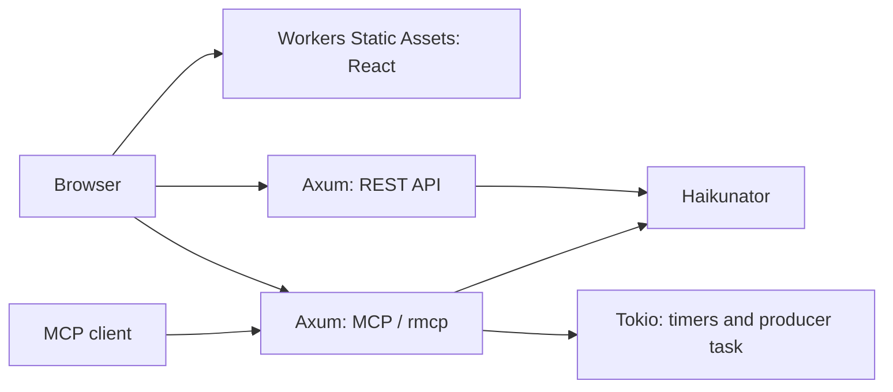

# Architecture

A Rust application built for `wasm32-unknown-emscripten` runs on Cloudflare Workers alongside the React frontend.

The REST API and MCP share one Worker. See [MCP reference](mcp.md) for tool behavior and streaming constraints.

## Experimental SDK adaptations

| Area | Implementation | Reason |
| --- | --- | --- |
| Cargo output | Build script selects the [previous output layout](https://github.com/rust-lang/cargo/pull/16807) | Compatibility with the pinned `worker-build` |
| API / JSON responses | Buffer up to 64 KiB | Avoid an experimental SDK response-bridge issue |
| MCP runtime | Isolated Tokio runtime per Emscripten request, retained until the response body finishes; JS promises connect it to the fetch handler | Keep asynchronous work alive throughout the response |
| SSE transport | Pump into a native `TransformStream`, bypassing the SDK adapter | Deliver streaming responses |
| Disconnects | `enable_request_signal` supplies disconnect events | Stop the SSE pump even while a write waits for its reader |
| MCP input | Drain the incoming body to EOF with a 16 KiB retention limit before routing | Dropping it early can cancel the HTTP connection and prevent error responses |
| Continuous generation | Tokio timers and a producer task | Deliver progress while other requests continue to run |

`security-headers.json` shares the development CSP and GitHub security-header preset between API and static responses.

## Dependency updates

The Workers SDK and `worker-build` use the same revision:
`b57ba6ef8198c65499c2f92b1845cc2412dd6e8c`. The Tokio patch is pinned in `Cargo.toml`. Update these together with the Rust toolchain.

## Dependencies

| Dependency | Role | Project |
| --- | --- | --- |
| Rust | Application language | [rust-lang.org](https://www.rust-lang.org/) |
| Axum | HTTP routing | [tokio-rs/axum](https://github.com/tokio-rs/axum) |
| Tokio | Async runtime and timers | [tokio.rs](https://tokio.rs/) |
| Cloudflare Workers SDK | Worker integration | [cloudflare/workers-rs](https://github.com/cloudflare/workers-rs) |
| Haikunator | String generation | [nishanths/rust-haikunator](https://github.com/nishanths/rust-haikunator) |
| MCP Rust SDK (`rmcp`) | MCP protocol | [modelcontextprotocol/rust-sdk](https://github.com/modelcontextprotocol/rust-sdk) |
