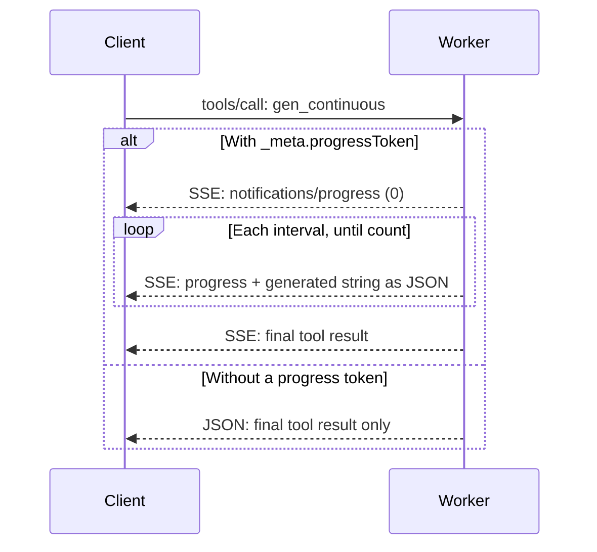

# MCP reference

Haikunator Generator provides Heroku-like memorable random strings through Streamable HTTP.

## Connection

| Setting | Value |
| --- | --- |
| Public endpoint | `https://haikunator-generator.goosysapp.net/mcp` |
| Local endpoint | `http://localhost:8787/mcp` (`pnpm dev`) |
| Authentication | None |
| Browser Origin | Public HTTPS URLs; local HTTP URLs only with `pnpm dev` |
| Native clients | Origin is optional; Host validation still applies |

## Access policy

Production accepts the Hosts from `url` and `workersDevUrl` in
`frontend/src/content/site.json`. Browser Origins must use these domains over
HTTPS on port 443.

Workers preview Hosts matching `<prefix>-<worker>.<account>.workers.dev` are
recognized automatically using the Worker and account from `workersDevUrl`.
The prefix uses ASCII letters, digits, or hyphens, starting and ending with a
letter or digit. Its length must keep `<prefix>-<worker>` within the DNS label
limit of 63 bytes. A preview accepts its own HTTPS Origin on port 443 and the
configured production Origins. Another preview's Origin is rejected, and
production does not accept preview Origins.

Production and previews reject `localhost` and `127.0.0.1` Hosts and Origins.
With `pnpm dev`, the development policy accepts these Hosts on port 8787 and
their HTTP browser Origins on ports 8787 and 5153. Native MCP clients can omit
Origin in either policy, but must still use an allowed Host.

## Tools

| Tool | Arguments | Structured result |
| --- | --- | --- |
| `gen` | None | `{"name":"cool-rice-4810"}` |
| `gen_continuous` | See below | `{"results":[{"name":"divine-limit-4413"},{"name":"wispy-resonance-4355"}]}` |

These examples are actual outputs from the deployed MCP server. Results also include equivalent JSON text content. Strings are not guaranteed to be unique.

| `gen_continuous` argument | Range | Default |
| --- | --- | --- |
| `count` | 1–20 | 5 |
| `interval_ms` | 100–2000 ms | 500 |

## Continuous generation

Each string is generated after one interval; a call lasts at most 40 seconds.



| Behavior | Constraint |
| --- | --- |
| Progress | Notifications run from 0 through `count` |
| Stop streaming | Close or abort the SSE request to stop generation |
| Abort JSON-only call | Local Wrangler continues generation; production cancellation is unverified |
| `notifications/cancelled` | Separate POSTs do not reach active calls |
| Sessions | Stateless; no session IDs or persistent GET SSE connections |
| Other MCP operations | `gen`, initialization, and discovery return JSON |

## Try locally

Call `gen` with MCP Inspector:

```sh
pnpm dlx @modelcontextprotocol/inspector@2.8.0 --cli \
  http://localhost:8787/mcp --transport http --method tools/call \
  --tool-name gen
```

For `gen_continuous`, replace the last line with:

```sh
  --tool-name gen_continuous --tool-arg count=2 --tool-arg interval_ms=500
```

For a streaming example, use **Start** / **Stop** in the website's continuous-generation panel.
